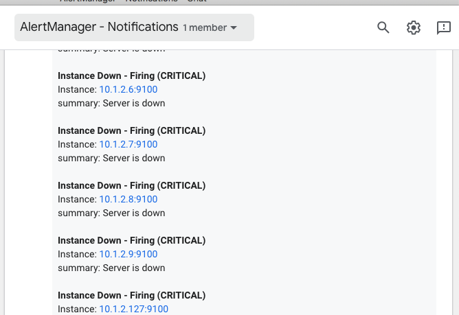

# calert


## Overview [](https://godoc.org/github.com/mr-karan/calert) [](https://goreportcard.com/report/github.com/mr-karan/calert)

`calert` is a lightweight binary to push [Alertmanager](https://github.com/prometheus/alertmanager) notifications to [Google Chat](http://chat.google.com) via webhook integration.


## Install

There are various ways of installing calert.

### Precompiled binaries

Precompiled binaries for released versions are available in the [*Releases* section](https://github.com/mr-karan/calert/releases/).

### Compiling the binary

You can checkout the source code and build manually:

```
$ mkdir -p $GOPATH/src/github.com/mr-karan/
$ cd $GOPATH/src/github.com/mr-karan
$ git clone https://github.com/mr-karan/calert.git
$ cd calert
$ make build
$ cp config.toml.sample config.toml
$ ./calert
```


## How to Use

`calert` uses Alertmanager [webhook receiver](https://prometheus.io/docs/alerting/configuration/#webhook_config) to receive alerts payload, and pushes this data to Google Chat [webhook](https://developers.google.com/hangouts/chat/how-tos/webhooks) endpoint.

- Download the binary and [sample config file](config.toml.sample) and place them in one folder.

```sh
mkdir calert-example && cd calert-example/
cp config.toml.sample config.toml # change the settings like hostname, address, google chat webhook url, timeouts etc in this file.
./calert.bin # this command starts a web server and is ready to receive events from alertmanager
```

- Set the webhook URL from Google Chat in `[app.notification_url]` section of `config.toml`. You can refer to the [official documentation](https://developers.google.com/hangouts/chat/quickstart/incoming-bot-python#step_1_register_the_incoming_webhook) for more details.

- Configure Alertmanager config file (`alertmanager.yml`) and give the address of calert web-server. You can refer to the [official documentation](https://prometheus.io/docs/alerting/configuration/#webhook_config) for more details.

You are now ready to send alerts to Google Chat!



## Configuration

- You can configure the default template for notification and create your own. Create a [template](https://golang.org/pkg/text/template/) file, similar to [message.tmpl](message.tmpl) and set the path of this file in `[app.template_file]` section of `config.toml`

- Alertmanager has the ability of group similar alerts together and fire only one event, clubbing all the alerts data into one event. `calert` leverages this and sends all alerts in one message by looping over the alerts and passing data in the template. You can configure the rules for grouping the alerts in `alertmanager.yml` config. You can read more about it [here](https://github.com/prometheus/docs/blob/master/content/docs/alerting/alertmanager.md#grouping)


## API

- POST `/create` (Used to receive new alerts and push to Google Chat)

```sh
# example request. (See examples/send_alert.sh)
➜ curl -XPOST -d"$alerts1" http://localhost:6000/create -i
{"status":"success","message":"Alert sent","data":null}
```

- GET `/ping` (Health check endpoint)
```sh
➜ curl http://localhost:6000/ping
{"status":"success","data":{"buildVersion":"025a3a3 (2018-12-26 22:04:46 +0530)","buildDate":"2018-12-27 10:41:52","ping":"pong"}}
```

## Examples

To help you quickly get started, you can `POST` a dummy payload which is similar to `Alertmanager` payload, present in [examples/send_alert.sh](examples/send_alert.sh).

## Contribution

PRs on Feature Requests, Bug fixes are welcome. Feel free to open an issue and have a discussion first. Read [CONTRIBUTING.md](CONTRIBUTING.md) for more details.

## License

[MIT](license)